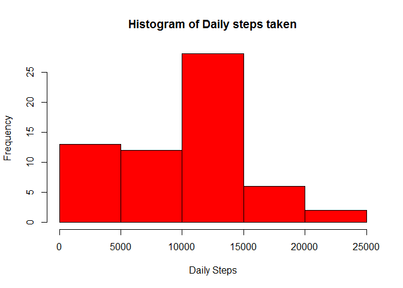
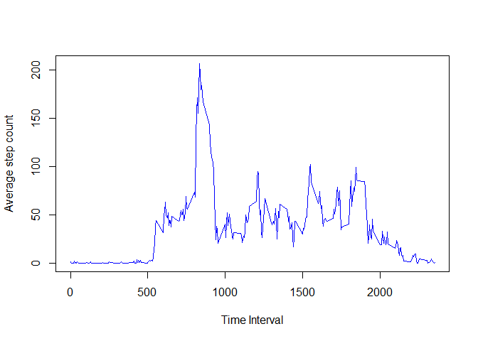
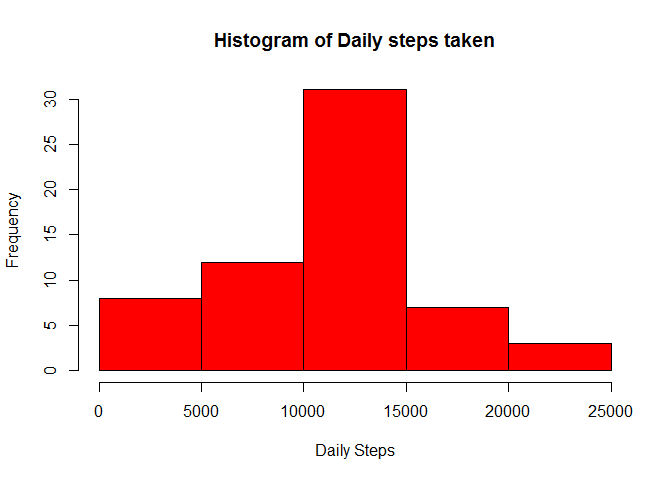
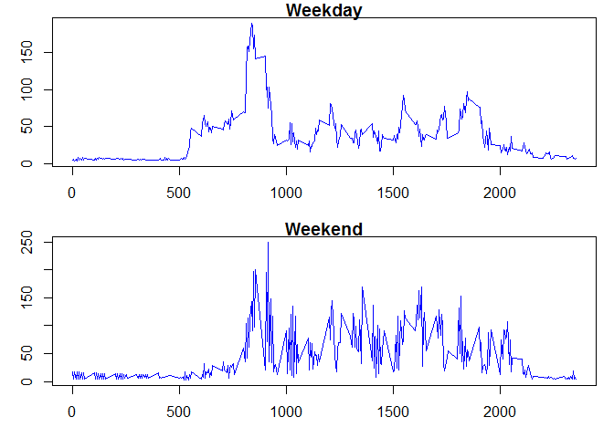

# Reproducible Research: Peer Assessment 1


## Loading and preprocessing the data
For loading the data we will assume that the dataset
has already been unzipped in the target directory. 
After loading the dataset, we find that the data consists of 
17568 observations of 3 variables. 

The three variables are the number of steps (int), the date (read in as strings), and the interval for which a measurement was made (int), as shown below. We also observe that there were dates for which no meansurements were made, resulting in NA values for steps taken. 

We convert the date variable to date values. The resulting converted data frame is shown below. 

We now create two data frames - one that contains NA values for steps and one that contains non NA values (or clean values). 


```r
## read the csv file and show the structure of the dataframe loaded
data <- read.csv("./activity/activity.csv")
str(data)
```

```
## 'data.frame':	17568 obs. of  3 variables:
##  $ steps   : int  NA NA NA NA NA NA NA NA NA NA ...
##  $ date    : Factor w/ 61 levels "2012-10-01","2012-10-02",..: 1 1 1 1 1 1 1 1 1 1 ...
##  $ interval: int  0 5 10 15 20 25 30 35 40 45 ...
```

```r
## convert the dates to date types in R
data$date <- as.Date(data$date, "%Y-%m-%d")
##now show the structure again 
str(data)
```

```
## 'data.frame':	17568 obs. of  3 variables:
##  $ steps   : int  NA NA NA NA NA NA NA NA NA NA ...
##  $ date    : Date, format: "2012-10-01" "2012-10-01" ...
##  $ interval: int  0 5 10 15 20 25 30 35 40 45 ...
```

```r
data_NA <- data[which(is.na(data$steps)==TRUE),]
data_clean <- data[which(is.na(data$steps) != TRUE),]
## show the composition of each of these frames
str(data_NA)
```

```
## 'data.frame':	2304 obs. of  3 variables:
##  $ steps   : int  NA NA NA NA NA NA NA NA NA NA ...
##  $ date    : Date, format: "2012-10-01" "2012-10-01" ...
##  $ interval: int  0 5 10 15 20 25 30 35 40 45 ...
```

```r
str(data_clean)
```

```
## 'data.frame':	15264 obs. of  3 variables:
##  $ steps   : int  0 0 0 0 0 0 0 0 0 0 ...
##  $ date    : Date, format: "2012-10-02" "2012-10-02" ...
##  $ interval: int  0 5 10 15 20 25 30 35 40 45 ...
```


## What is mean total number of steps taken per day?

To calculate the total steps taken by day we will consider only the clean data set (i.e. non NA values) and first create a data frame that aggregates the total number of steps per day. We will then compute the mean and median for the total steps taken per day. 


```r
## find total steps taken by day
dailysteps <- aggregate(data_clean$steps, by = list(Category = data_clean$date), FUN = sum)

str(dailysteps)
```

```
## 'data.frame':	53 obs. of  2 variables:
##  $ Category: Date, format: "2012-10-02" "2012-10-03" ...
##  $ x       : int  126 11352 12116 13294 15420 11015 12811 9900 10304 17382 ...
```

```r
# we then plot the histogram of the calculated sum
hist(dailysteps$x, xlab = "Daily Steps",
      main = "Histogram of Daily steps taken",
      col = "red")
```

 

```r
## we also calculate the mean and median of daily steps taken
dailysteps_mean <- format(mean(dailysteps$x), digits = 10)
dailysteps_median <- format(median(dailysteps$x), digits = 10)

##post the figure in the figure folder
dev.copy(png, './instructions_fig/steps_hist.png')
```

```
## png 
##   3
```

```r
dev.off()
```

```
## pdf 
##   2
```
The mean total number of steps taken per day is 
**10766.18868**

The median total number of steps taken per day is 
**10765**

## What is the average daily activity pattern?
To find the average daily pattern we create a new frame called avgsteps. We aren't converting intervals to timestamps. 


```r
avgsteps <- aggregate(data_clean$steps, by = list(Category = data_clean$interval), FUN = mean)

str(avgsteps)
```

```
## 'data.frame':	288 obs. of  2 variables:
##  $ Category: int  0 5 10 15 20 25 30 35 40 45 ...
##  $ x       : num  1.717 0.3396 0.1321 0.1509 0.0755 ...
```

```r
##now show the plot
plot(avgsteps$x~avgsteps$Category, type = 'l', xlab = "Time Interval",
      ylab = "Average step count",
     col = "blue")
```

 

```r
## find the interval with the max average step count
max_interval <- avgsteps$Category[which.max(avgsteps$x)]

##copy figure to figure folder
dev.copy(png, './instructions_fig/interval.png')
```

```
## png 
##   3
```

```r
dev.off()
```

```
## pdf 
##   2
```


The interval with the max average step count is 
**835**

## Imputing missing values
We find the number of rows in the dataset that have missing values
using the following code

```r
NA_rows = nrow(data_NA)
```
There are **2304** that have NA values in the dataset

We will impute missing values with **the average steps for that interval** and replace NA values with these averages. The following code shows the method

```r
## we've calculated the avgsteps data frame above
## merge that with the NA data
newNA <- merge(data_NA, avgsteps, by.x = "interval", by.y = "Category")

## now replace the steps NA data with these new values
newdata <- data
newdata$steps <- replace(newdata$steps, which(is.na(newdata$steps)), newNA$x)
str(data)
```

```
## 'data.frame':	17568 obs. of  3 variables:
##  $ steps   : int  NA NA NA NA NA NA NA NA NA NA ...
##  $ date    : Date, format: "2012-10-01" "2012-10-01" ...
##  $ interval: int  0 5 10 15 20 25 30 35 40 45 ...
```

```r
str(newdata)
```

```
## 'data.frame':	17568 obs. of  3 variables:
##  $ steps   : num  1.72 1.72 1.72 1.72 1.72 ...
##  $ date    : Date, format: "2012-10-01" "2012-10-01" ...
##  $ interval: int  0 5 10 15 20 25 30 35 40 45 ...
```

Now we repeat the histogram work

```r
## find total steps taken by day for the new dataset (newdata)

newdailysteps <- aggregate(newdata$steps, by = list(Category = newdata$date), FUN = sum)


# we then plot the histogram of the calculated sum
hist(newdailysteps$x, xlab = "Daily Steps",
      main = "Histogram of Daily steps taken",
      col = "red")
```

 

```r
## we also calculate the mean and median of daily steps taken
dailysteps_mean_new <- format(mean(newdailysteps$x), digits  = 10)
dailysteps_median_new <- format(median(newdailysteps$x), digits = 10)


##post the figure in the figure folder
dev.copy(png, './instructions_fig/steps_hist_newdata.png')
```

```
## png 
##   3
```

```r
dev.off()
```

```
## pdf 
##   2
```

The mean total number of steps taken per day is 
**10766.18868**

The median total number of steps taken per day is 
**11015**

As we can see, the mean has remained unchanged but median total steps taken are different (higher) for this new dataset (with NA values imputed). 

Old mean value was 10766.18868. 

new mean value is 10766.18868

Old median value was 10765. 

new median value was 11015

The impact of imputing missing NA values was to increase the total number of daily steps taken since. The difference is visible in the new histogram which shows a greater number days for each frequency bin across the board. 


## Are there differences in activity patterns between weekdays and weekends?

We first create the weekday/weekend column as follows. then plot them in a single panel. The layout won't match the sample plots exactly since we're using the base plotting package for this exercise. 


```r
## add a new column to the newdata frame
newdata[, "day"] <- weekdays(newdata$date)
##now replace Monday-Friday with "weekday"
newdata$day <- replace(newdata$day, which(newdata$day != c("Sunday", "Saturday")), "Weekday")
## now replace Saturday and Sunday with "weekend"
newdata$day <- replace(newdata$day, which(newdata$day == c("Sunday", "Saturday")), "Weekend")

#now we form two frames for weekdays and weekends
newdata_wkday <- subset(newdata, day == "Weekday")
newdata_wkend <- subset(newdata, day == "Weekend")


## now find mean steps per interval for both
wkday_avgsteps <- aggregate(newdata_wkday$steps, by = list(Category = newdata_wkday$interval), FUN = mean)

wkend_avgsteps <- aggregate(newdata_wkend$steps, by = list(Category = newdata_wkend$interval), FUN = mean)


str(wkday_avgsteps)
```

```
## 'data.frame':	288 obs. of  2 variables:
##  $ Category: int  0 5 10 15 20 25 30 35 40 45 ...
##  $ x       : num  5.18 5.95 3.6 5.76 3.54 ...
```

```r
str(wkend_avgsteps)
```

```
## 'data.frame':	288 obs. of  2 variables:
##  $ Category: int  0 5 10 15 20 25 30 35 40 45 ...
##  $ x       : num  17.93 3.75 17.93 3.75 17.93 ...
```

```r
## now plot them in a panel
par(mfrow = c(2,1))
par(mar = c(3,3,1,1))

plot(wkday_avgsteps$x ~ wkday_avgsteps$Category, 
     type = 'l', xlab = "",
      ylab = "",
     col = "blue",
     main = "Weekday")

plot(wkend_avgsteps$x ~ wkend_avgsteps$Category, 
     type = 'l', xlab = "Time Interval",
      ylab = "",
     col = "blue",
     main = "Weekend")
```

 

```r
# post this panel in the figures folders

dev.copy(png, './instructions_fig/AvgSteps_Panel.png')
```

```
## png 
##   3
```

```r
dev.off()
```

```
## pdf 
##   2
```

There are differences in the activity patterns between weekdays and weekends, particularly as the day progresses. 

Weekday activity starts earlier during the day (intervals 500 to 900) presumably due to subjects preparing, and heading to work. After that, activity seems to subside indicating perhaps office work starting for participants. 

Weekend activity starts later during the day. We can see activity starting to spike around interval 900, which is much later than start of activity for weekdays. In addition, we see sustained, higher activity levels during later intervals (afternoons and evenings) presumably due to participants engaging in weekend outdoor activities. 
